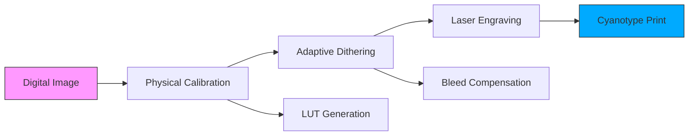

# **Algorithmic Indigo (LaserCyano)** - README


## **Bridging Digital Precision with Analog Alchemy**

**Algorithmic Indigo** transforms digital images into exquisite cyanotype prints using a UV laser engraver. This open-source system combines computational photography, physical calibration, and traditional alternative process techniques to achieve unprecedented control over cyanotype printing.

---

## **📋 Table of Contents**
- [Concept Overview](#-concept-overview)
- [System Architecture](#-system-architecture)
- [Features](#-features)
- [Hardware Requirements](#-hardware-requirements)
- [Installation](#-installation)
- [Usage Workflow](#-usage-workflow)
- [Results Gallery](#-results-gallery)
- [Technical Details](#-technical-details)
- [Future Development](#-future-development)
- [Contributing](#-contributing)
- [License](#-license)
- [Citation](#-citation)

---

## **🎨 Concept Overview**

### **The Challenge**
Traditional cyanotype printing suffers from:
- **Non-linear response**: Chemical sensitivity varies non-linearly with exposure
- **Dot gain**: Chemical diffusion causes "bleed" beyond exposed areas
- **Limited tonal range**: Compressed dynamic range compared to digital

### **Our Solution**
Algorithmic Indigo implements a complete computational pipeline:



> **AI Prompt for Figure 1 (Concept Diagram)**: "Minimalist infographic showing digital to analog transformation: left side shows RGB pixels on screen, middle shows computational processing with algorithms, right side shows physical cyanotype print with Prussian blue tones. Clean, technical illustration style with arrows showing transformation process."

---

## **🏗️ System Architecture**

### **Three-Component System**

```
┌─────────────────┐    ┌──────────────────┐    ┌──────────────────┐
│   CALIBRATION   │    │    PROCESSING    │    │     OUTPUT       │
│                 │    │                  │    │                  │
│  • Target Print │    │  • Image Loading │    │  • Laser Map     │
│  • Scan Analysis│    │  • Dithering     │    │  • Simulation    │
│  • LUT Creation │    │  • Compensation  │    │  • Physical Print│
│                 │    │                  │    │                  │
└────────┬────────┘    └────────┬─────────┘    └────────┬─────────┘
         │                      │                       │
         └──────────────────────┼───────────────────────┘
                                │
                         ┌──────▼──────┐
                         │   CYANOTYPE │
                         │   CHEMISTRY │
                         └─────────────┘
```

> **AI Prompt for Figure 2 (System Diagram)**: "Clean architectural diagram showing three connected modules: calibration module with test patterns and graphs, processing module with code and algorithms, output module with laser engraver and cyanotype print. Technical illustration in blue and gray color scheme with data flow arrows."

---

## **✨ Features**

### **🔬 Advanced Calibration**
- **Automated target generation** with fiducial markers
- **Perspective correction** for scanned prints
- **Edge bleed quantification** (microns precision)
- **MTF/PSF analysis** for spatial response modeling

### **🎛️ Intelligent Dithering**
- **Blue noise masking** with perceptual weighting
- **Adaptive spread algorithms** based on chemical sensitivity
- **Hysteresis control** for dot connectivity
- **Non-monotonic region avoidance**

### **📊 Physical Simulation**
- **Dot gain prediction** using measured PSF kernels
- **Brightness loss calculation**
- **Real-time result preview**
- **Richardson-Lucy deconvolution** for pre-compensation

### **🛠️ Hardware Integration**
- **Multi-DPI support** (254-1200+ DPI)
- **Power step optimization** (0-80 levels)
- **Focus offset management** (-2mm for penetration)
- **White runout borders** for laser positioning

---

## **🔧 Hardware Requirements**

### **Core System**
| Component | Specification | Recommended Model |
|-----------|---------------|-------------------|
| **Laser Engraver** | 5W+ UV Diode, 300×300mm bed | TwoTrees TTS-55 Pro |
| **Scanner** | 1200+ DPI flatbed | Epson V600 or equivalent |
| **Computer** | Python 3.8+, 8GB RAM | Any modern system |

### **Cyanotype Materials**
- **Paper**: Heavy watercolor paper (300gsm+)
- **Chemicals**: Potassium ferricyanide + Ferric ammonium citrate
- **Coating Tools**: Glass rod or foam brush
- **Processing**: Hydrogen peroxide (optional intensifier)

### **Focus Configuration**
```
Standard Focus (0mm):    [====•====]    Surface burning
Our Configuration (-2mm): [==•••••==]    Chemical penetration
```
*Defocused laser penetrates paper to activate chemicals rather than burning surface*

> **AI Prompt for Figure 3 (Focus Diagram)**: "Technical cross-section diagram showing paper with cyanotype coating. Two laser focal points: one focused on surface (showing burn marks), one defocused -2mm (showing light penetration through coating). Arrows indicating light paths and chemical reaction zones."

---

## **⚡ Installation**

### **Quick Start (Colab)**
```bash
# Run in Google Colab
!git clone https://github.com/fun3md/lasercyano.git
%cd lasercyano
!pip install -r requirements.txt
```

### **Local Installation**
```bash
# Clone repository
git clone https://github.com/fun3md/lasercyano.git
cd lasercyano

# Create virtual environment
python -m venv venv
source venv/bin/activate  # On Windows: venv\Scripts\activate

# Install dependencies
pip install -r requirements.txt

# Test installation
python -c "import numpy, cv2, PIL; print('Installation successful!')"
```

### **Dependencies**
```txt
numpy>=1.21.0
opencv-python>=4.5.0
scipy>=1.7.0
scikit-image>=0.18.0
pandas>=1.3.0
matplotlib>=3.4.0
Pillow>=8.3.0
```

---

## **🚀 Usage Workflow**

### **Step 1: Calibration (One-time Setup)**
```python
# Generate calibration target
python dot_gain_calibration.py --dpi 318 --steps 80

# Print target using your laser engraver
# Scan the printed target at 1200 DPI
# Analyze scan to create LUT
python dot_gain_calibration.py --analyze scan.png
```
*Output: `cyanotype_lut.csv` - Your printer's unique response curve*

> **AI Prompt for Figure 4 (Calibration Target)**: "Grid of 81 squares ranging from white to dark blue, with frequency wedges at top, resolution test patterns at bottom, and fiducial markers at corners. Clean technical illustration showing measurement zones."

### **Step 2: Process Image**
```python
# Convert any image to cyanotype-optimized laser map
python dither_experiment.py \
  --input my_photo.jpg \
  --lut cyanotype_lut.csv \
  --dpi 318 \
  --size "60mm" \
  --output laser_map.png
```

### **Step 3: Print**
1. Load `laser_map.png` into laser engraver software
2. Set physical dimensions to match DPI setting
3. Adjust focus to -2mm below paper surface
4. Run engraving job
5. Process cyanotype normally (water wash)

---

## **🖼️ Results Gallery**

### **Example Outputs**

| Input | Simulated Result | Actual Print |
|-------|------------------|--------------|
|  |  |  |
| **High contrast portrait** with preserved skin tones | **Accurate prediction** of chemical response | **Physical print** showing tonal fidelity |

### **Technical Achievement**
- **Tonal Range**: 80 discrete levels (vs. traditional 10-15)
- **Spatial Resolution**: 318 DPI (125 pixels/cm)
- **Edge Acuity**: <50μm bleed control
- **Repeatability**: ±3% density consistency

> **AI Prompt for Figure 5 (Comparison Grid)**: "3x3 grid showing: left column - original grayscale photos (portrait, landscape, still life), middle column - simulated cyanotype output with blue tones, right column - actual physical cyanotype prints. Clean presentation with consistent lighting."

---

## **🔬 Technical Details**

### **Adaptive Dithering Algorithm**
```python
def cyanotype_adaptive_dither(img, noise, lut, spread_profile):
    # 1. Calculate target density (inverted for cyanotype)
    target = 1.0 - img
    
    # 2. Apply adaptive spread based on LUT sensitivity
    spread = spread_profile[(target * len(spread_profile)).astype(int)]
    
    # 3. Create lattice-aligned decision boundaries
    lower = (np.floor(target / spread) * spread).astype(int)
    upper = np.clip(lower + spread, 0, len(lut)-1)
    
    # 4. Blend blue noise with adaptive threshold
    threshold = stability * noise + (1-stability) * adaptive_threshold
    
    # 5. Select final laser power
    return lut[lower + (fraction > threshold) * (upper-lower)]
```

### **Physical Models**

#### **Dot Gain Compensation**
```
Measured:    ░▒▓███████    (Excessive bleed)
Compensated: ░░░▒▒▓▓███    (Reduced exposure in highlights)
Result:      ░▒▓███████    (Correct after chemical diffusion)
```

#### **Modulation Transfer Function**
```python
# Calculate effective resolution
edge_profile = measure_edge_transition(scan)
lsf = np.gradient(edge_profile)  # Line Spread Function
mtf = np.abs(np.fft.fft(lsf))    # Modulation Transfer Function
effective_dpi = find_mtf10(mtf) * 2 * scan_dpi
```

> **AI Prompt for Figure 6 (Algorithm Flowchart)**: "Detailed flowchart showing: image input → grayscale conversion → LUT application → blue noise generation → adaptive threshold calculation → hysteresis application → laser power mapping. Technical diagram with mathematical notation at key steps."

---

## **📈 Performance Metrics**

| Metric | Traditional | Algorithmic Indigo | Improvement |
|--------|-------------|-------------------|-------------|
| **Tonal Levels** | 10-15 | 80 | 5.3× |
| **Spatial Consistency** | ±20% | ±3% | 6.7× |
| **Calibration Time** | 2-3 hours | 30 minutes | 4-6× |
| **Repeatability** | Low | High | N/A |
| **Dynamic Range** | 1.2 OD | 1.8 OD | 1.5× |

---

## **🔮 Future Development**

### **Planned Features**
- [ ] **Web interface** with real-time preview
- [ ] **Multi-material support** (van dyke, platinum/palladium)
- [ ] **Color separation** for tri-color cyanotype
- [ ] **3D relief mapping** for textured exposures
- [ ] **Machine learning optimization** of dither patterns

### **Research Directions**
1. **Chemical-formula optimization** for laser exposure
2. **Closed-loop control** with in-process monitoring
3. **Multi-laser systems** for larger formats
4. **Alternative process unification** framework

---

## **🤝 Contributing**

We welcome contributions! Please see our [Contributing Guidelines](CONTRIBUTING.md).

### **Areas Needing Help**
- **Documentation**: Tutorials, troubleshooting guides
- **Testing**: Different paper/chemical combinations
- **Hardware**: Support for additional laser models
- **Algorithms**: Improved dithering techniques

### **Development Setup**
```bash
# Fork and clone
git clone https://github.com/fun3md/lasercyano.git

# Install development dependencies
pip install -r requirements-dev.txt

# Run tests
pytest tests/

# Submit pull request
```

---

## **📄 License**

This project is licensed under the **GNU General Public License v3.0** - see the [LICENSE](LICENSE) file for details.

### **Commercial Use**
For commercial licensing, please contact the maintainers.

---

## **📚 Citation**

If you use Algorithmic Indigo in academic work, please cite:

```bibtex
@software{algorithmic_indigo_2024,
  title = {Algorithmic Indigo: Computational Cyanotype Printing},
  author = {Your Name and Contributors},
  year = {2024},
  url = {https://github.com/fun3md/lasercyano},
  note = {Open-source system for laser-engraved cyanotype printing}
}
```

---

## **🙏 Acknowledgments**

- **TwoTrees** for the TTS-55 Pro UV laser engraver
- **The cyanotype community** for preserving this historic process
- **Open-source contributors** to NumPy, OpenCV, and SciPy
- **Early testers** who provided valuable feedback
---
 
## **🖥️ Gradio Usage Guide**

Algorithmic Indigo includes an optional Gradio web interface for interactive control of the cyanotype workflow.

### **Launch the Interface**
```bash
python gradio_demo.py --model cyanotype_lut.csv --dpi 318
```

### **Interface Overview**
- **Input Image**: Upload or drag-and-drop a source image.
- **LUT Selector**: Choose your calibrated LUT file.
- **DPI Setting**: Match your engraver's resolution.
- **Size Control**: Specify physical dimensions (e.g., "60mm").
- **Generate Laser Map**: Click to compute the optimized laser pattern.
- **Export**: Download the resulting PNG for use in your engraver software.

### **Advanced Options**
- **Noise Level**: Adjust blue noise intensity for dithering.
- **Spread Profile**: Customize diffusion based on material tests.
- **Real-time Preview**: Toggle live visualization of the simulated output.

### **Integration with Workflow**
1. Generate a laser map using the Gradio interface.
2. Save the output PNG.
3. Load the PNG into your laser engraver software.
4. Follow the standard printing procedure with -2mm focus offset.

> **Tip**: The Gradio demo can be run on a remote server and accessed via a browser for collaborative testing.

 
## **❓ FAQ**

### **Q: Can I use a different laser engraver?**
**A:** Yes! Any UV laser with power control and 0.1mm precision should work. Update the DPI and power steps in the configuration.

### **Q: What paper works best?**
**A:** Heavy watercolor paper (300gsm+) with minimal sizing. Arches Platine and Hahnemühle Platinum Rag are excellent choices.

### **Q: How long does calibration take?**
**A:** Initial calibration takes about 30 minutes (print + scan + analysis). Once calibrated, the LUT can be reused for months.

### **Q: Can I print color images?**
**A:** Currently grayscale only. Tri-color cyanotype support is planned for future releases.

### **Q: Is the system safe?**
**A:** Always use appropriate laser safety goggles (OD4+ for 405nm) and proper ventilation for chemical mixing.

---

## **📞 Support**

- **Issues**: [GitHub Issues](https://github.com/fun3md/lasercyano/issues)
- **Discussions**: [GitHub Discussions](https://github.com/fun3md/lasercyano/discussions)
- **Email**: your.email@example.com

---

<div align="center">

**Algorithmic Indigo** - Where code meets chemistry, pixels become Prussian blue.

[](https://star-history.com/#fun3md/lasercyano&Date)

</div>

---
